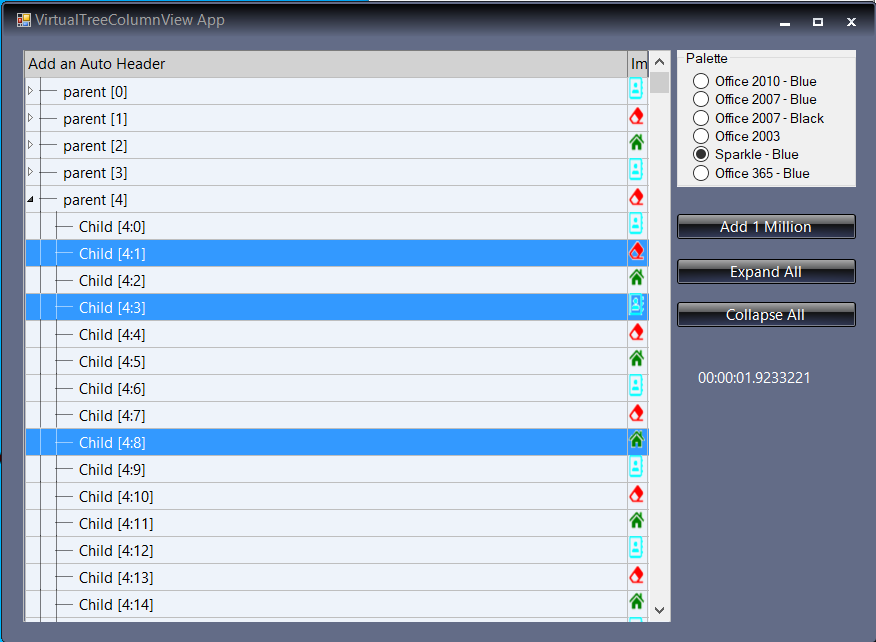

<!-- Start Document Outline -->

* [VirtualTreeGrid](#virtualtreegrid)
	* [Things of note in the picture](#things-of-note-in-the-picture)
	* [Usage](#usage)
* [ToDo - ie Implement and Test !](#todo---ie-implement-and-test-)

<!-- End Document Outline -->

# `VirtualTreeGrid`
"Virtual Tree View" control that is also able to display multiple columns.

## Things of note in the picture
- Sparkle Theme has coloured the back of the grid
- Open close images are from the the theme
- Formatted text callback for column 
- Image drawn in column
- Time taken to add 1 million entries
- MultiSelect

## Usage
- [x] Krypton Theme responsive (In designer)
- [X] Demo Application
- [X] Multi Select
- [X] Generic Class for Row storage (User PoCo/Dto)
- [X] Draw control per cell
- [X] Optional display of headers
- [X] Able to display specified row (Ensure visible)
- [X] Multi level tree node
- [X] Specify image for Open / close branches
- [X] Able to add image for each row
- [X] Format control of text in each cell
- [x] VScroll bar
- [X] Row click event (single)

# ToDo - ie Implement and Test !
- [ ] Checkbox(s)
- [ ] HScroll bar
- [ ] Keyboard control (Arrow keys / space bar / etc)
- [ ] Mouse Wheel
- [ ] Krypton Right click Menu
- [ ] Cell edit
- [ ] Sorting callback
- [ ] Header click events
- [ ] Row click event (double)
- [ ] DataSource
- [ ] Other things as I think of them
- [ ] Row Tracking