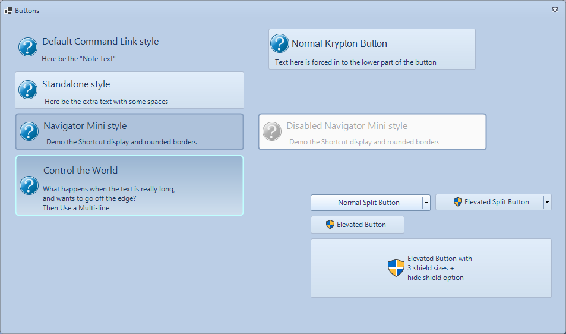

<!-- Start Document Outline -->

* [Extended Buttons](#ExtendedButtons)
	* [Things of note in the picture](#things-of-note-in-the-picture)
	* [Usage](#usage)
* [ToDo](#todo)

<!-- End Document Outline -->

# `ExtendedButtons`

## Things of note in the picture
- x2 Command link style buttons
- x2 Types of dropdown buttons - x1 normal button + x1 elevated button
- x2 Types of elevated buttons
- x1 `KryptonViewButtons`

## Usage
- Drag and drop control on a `KryptonForm`
- With the UAC enabled buttons, you don't need to invoke the `Click()` event, as all elevation code is handled within the button itself
- Command link buttons require design configuration on the developers' part

# ToDo
- Drop-in dialog buttons w/ elevation options