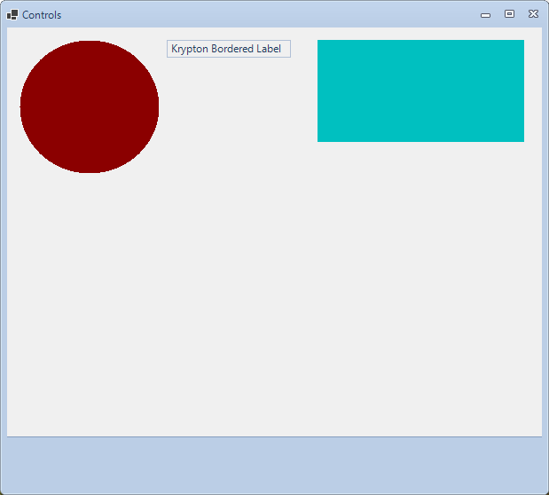

<!-- Start Document Outline -->

* [Extended Controls](#ExtendedControls)
	* [Things of note in the picture](#things-of-note-in-the-picture)
	* [Usage](#usage)
* [ToDo](#todo)

<!-- End Document Outline -->

# `ExtendedControls`

## Things of note in the picture
- Circular picture box
- Krypton label with a border
- Krypton flow layout panel (highlighted in teal)
- Krypton button panel - mimics the `KryptonMessageBox` button panel look and feel

## Usage
- Drag and drop control on a `KryptonForm`
- The `KryptonButtonPanel` will dock to the bottom of the `KryptonForm` automatically

# ToDo
- Implement other controls