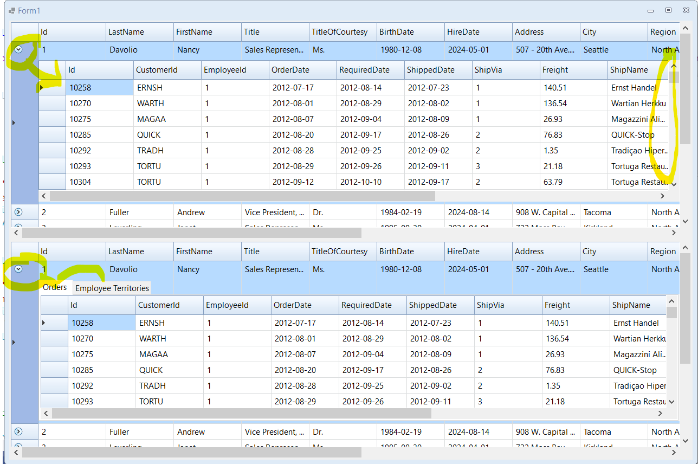
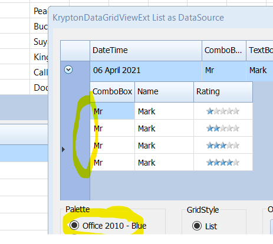

<!-- Start Document Outline -->

* [DataGridView](#datagridview)
	* [Things of note in the picture](#things-of-note-in-the-picture)
	* [Usage](#usage)
		* [ExtraDesignerVariables](#extradesignervariables)
		* [Launch List View](#launch-list-view)
	* [Single Detail View](#single-detail-view)
	* [Multi Detail View](#multi-detail-view)
* [Notes](#notes)
* [ToDO](#todo)

<!-- End Document Outline -->

# DataGridView

## Things of note in the picture
- Drop Arrow indicating active Details view
- RowHeader indicating which is active (In case child view has similar header to master)
- Scroll bar for the Details view
- MultiView showing Tabs for each Child
- Krypton theming

## Usage
- The default display (as above) shows a single Detail View at the top, and a Multi Detail View at the bottom.  
- The "Launch List View" list button in the Title bar shows how to use custom Lists as a dataset and also custom columns.    
- You *have* to click on the circular arrow to make the Row Expand / Collapse.
### ExtraDesignerVariables

### Launch List View

- The List view form allows the themes to be changed across the application.
- Demonstrates the removal of the Details row headers
- Demonstrates the use of FullRowSelect, and clicking on any cell, expands / collapses the details
- Demonstrates the usage of an ExtColumn type (Rating)
- Shows how to hide columns 
- Demonstrates the Detail DataGridView MaxHeight; (Min is 100)
- How to implement the re-sortable single list
  - Mandy has 1 Item
  - Mark has 4
  - If there are no Details Rows exist, then the Details view will not be shown. (And not `AllowUserToAddRows`)

## Single Detail View
This allows a Master Detail view to be seen with very little code from the client side

## Multi Detail View
Places Child Detail views into tabs under each Master row.

# Notes
In order to keep the code working on TFM's before net48, the code base from https://github.com/igor-tkachev/Portable.System.ValueTuple - `Portable.System.ValueTuple.cs` has been taken and adapted to only support `Tuple'T2`

# ToDO
- Deal with no Details for a Master row
- Make the Details view height dynamic
- Add Max Height Design control for MaxHeight
- More Documentation
