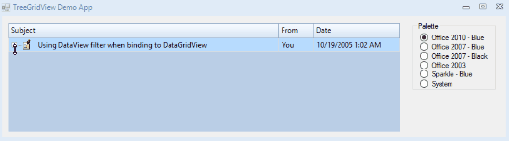
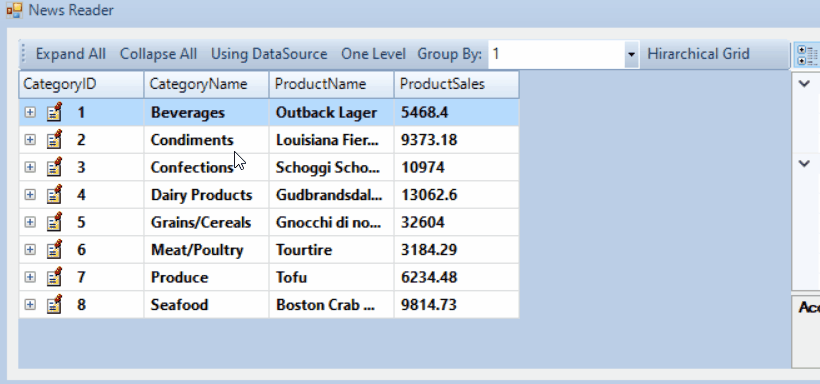

<!-- Start Document Outline -->

* [TreeGridView](#treegridview)
	* [History](#history)
	* [Progmatic Creation](#progmatic-creation)
	* [DataSource Creation](#datasource-creation)
	* [Notes from the original Author](#notes-from-the-original-author)
		* [Design](#design)
			* [Custom Painting](#custom-painting)
			* [Siting/Unsiting a node](#sitingunsiting-a-node)
			* [Unbound](#unbound)
			* [Edit Mode](#edit-mode)
		* [Object model structure](#object-model-structure)
			* [TreeGridNode](#treegridnode)
			* [TreeGridCell/Column](#treegridcellcolumn)
			* [TreeGridView](#treegridview-1)
* [ToDo](#todo)

<!-- End Document Outline -->

# TreeGridView
## History
The original source of this code came from "Mark Rideout" via https://docs.microsoft.com/en-us/archive/blogs/markrideout/customizing-the-datagridview-to-support-expandingcollapsing-ala-treegridview.

It was then taken for a ride by several developers to fix some issues, and extend it to take a data source. Then "AngeloCresta" created a Kryptonised version https://github.com/ncarp/ExtendedRenderer/tree/master/TreeGridView, but did not give any supporting examples of how to use it.

Sometime during amalgamation of the extended suite "WagnerP" moved the code into the code base https://github.com/Krypton-Suite-Legacy-Archive/Krypton-Toolkit-Suite-Extended-NET-5.470/tree/master/Source/Krypton%20Toolkit%20Suite%20Extended/Full%20Toolkit/Extended%20Controls/ExtendedToolkit/Controls/TreeGridView where it rested for a while.

Then "Smurf-IV", picked it up and 
- Found the above history, 
- Converted the code into the latest Extended standard way of doing things, 
- Fixed the code style and usages, 
- Added example usages (As far as possible), 
- and Created this read me ;-)

## Progmatic Creation

## DataSource Creation

## Notes from the original Author
### Design
I wanted to ensure that the design of the TreeGridView supported normal TreeView type properties and features, so creating necessary classes to create the “tree view” experience was necessary (see object model for more details).

#### Custom Painting
Painting an image in a cell is easy, but ensuring that the text from the DataGridViewTextBoxCell didn’t overlap the image took a bit of work. Using the Padding feature of the DataGridViewCellStyle, I add padding to the left side of the cell to account for the text and the indentation. This padding affects the painting and behavior of the text box cell, so editing a text cell correctly positions the editing control.

#### Siting/Unsiting a node
Since I don’t want to set padding and styling except when a node is actually displayed. When the node is displayed or in the grid, it is sited. When the node is sited I set all the necessary properties.

#### Unbound
Since expanding and collapsing is based upon dynamically adding and removing rows from the grid, I decided that unbound mode would be the best way to go with this. I’ve hidden the “databinding” properties and the virtual mode property since this doesn’t support those features.

#### Edit Mode
One thing that I had to deal with is that double-clicking a cell enters edit mode. This double-click occurs regardless of the padding, so double-click on the +\- symbol causes the control to enter edit mode. Edit also enters if you single click on a cell that already has focus. So, to deal with this I turn edit mode to be enabled only through programmatic means. I have code to handle the F2 key to enter edit mode. There are other ways to solve this, but I went with the F2 approach.

### Object model structure

#### TreeGridNode
- Just like a tree view, I wanted to have the concept of a node. I made the nodes class derive from a DataGridViewRow since a node in the list is the same as a row, just with a bit more info.

##### Here are some properties:

    Nodes – Again, like the treeview, a node has children, so there is a Nodes property that returns child nodes. One of the challenges in coding this is to know when a node is actually a row or when it is just a node. A node is a row when it is in the grid, otherwise it is just a node.

    IsSited – A node is “sited” when it is contained in the grid as a row. The Sited property is true in this case. There are a set of protected virtual methods on the TreeGridView class (SiteNode and UnSiteNode).

    ImageIndex – Image index for the node’s image. Only used when an ImageList is associated with the TreeGridView.

    Image – Image associated with the node. Sets or gets the image. When an ImageList is associated with the TreeGridView and an ImageIndex is set then this returns an image from the ImageList. You can set the Image property to an image if you aren’t using an ImageList.

    Cells – Returns the cells for the given node. This wasn’t easy to do since accessing the cells for a node (or row) when the node isn’t sited. Using the DataGridView’s CreateCells method I can get the correct cells collection when the node isn’t in the grid.

#### TreeGridCell/Column
This is a special DataGridView cell that derives from the DataGridViewTextBoxCell. The main thing that this custom cell class does is to customize the cell drawing to make it look like a tree node. That means that it draws the node’s image and the +/- icons and the tree lines. The custom cell also is where a node detects when you click the mouse to expand or collapse a node. NOTE: A lot more work can be done to correctly detect that the mouse is directly over the +/- image. Right now I’m not doing that.

#### TreeGridView 
This class derives from the DataGridView control. Many things are done in this class. Nodes are sited/unsited in the grid as actual rows. Somce DataGridView Properties are hidden since they do not apply.

##### Here are some properties:

    VirtualNodes – One of the common things done with a normal TreeView is to dynamically add child nodes when the user is expanding the parent. With the normal TreeView usres add temp child nodes to get the + sign and support expanding, then remove the temp node later. With the VirtualNodes property, the TreeGridView always displays a + sign next to a node, even if the node doesn’t have any children. Then, by handling the Expanding event you can dynamically add child nodes.

    ImageList – ImageList associated with the TreeGridView

    Nodes – Identifies the root nodes.

    ShowLines – Determines if the TreeGridView shows lines between nodes.

    CurrentNode – Identifies the node that has focus.

##### Here are some events:

    Expanding – Again, like the treeview, this event occurs before a node is starting to expand. You can add nodes in this event to fill in more details of a child node collection. When the VirtualNodes property is true, the TreeGridView will display the node with a + sign next to it even when it doesn’t have any children. Handling the Expanding event is where you would dynamically add new child nodes.

    Expanded – After a node is expanded.

    Collapsing – Before a node is being collapsed

    Collapsed – After a node has been collapsed.

# ToDo
- Addition of `tri-state Checkboxes`
- Themed Checkboxes
- Themed "+" "-" symbols
- Addition of user images for Expansion and checkboxes
